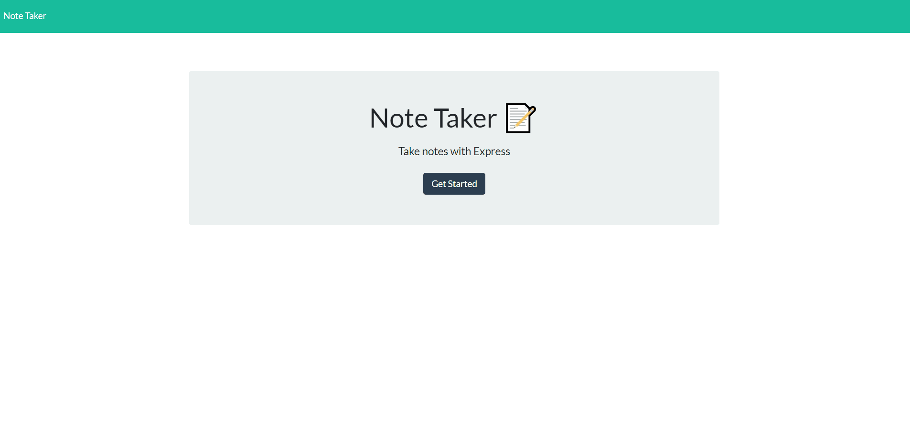

# Note Me

## Description
Note Me is a website that you can keep notes on that remain even after refreshing the page. It uses a live server to read a json file filled with the notes that are saved. New notes can be saved and old notes can be deleted. 

## Built With
* JavaScript
* Node.js
* Express.js
* HTML
* CSS

## NPM Packages
[Nano Id](https://github.com/ai/nanoid)

Command:

```npm install --save nanoid```


## Deployed URL
[https://gentle-sands-16439.herokuapp.com/](https://gentle-sands-16439.herokuapp.com/)

## Screenshot
